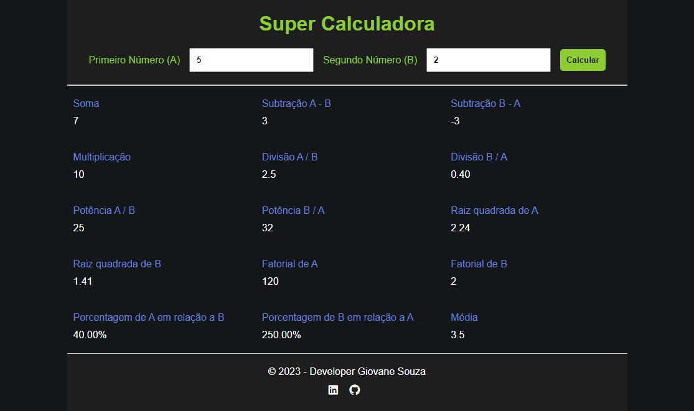
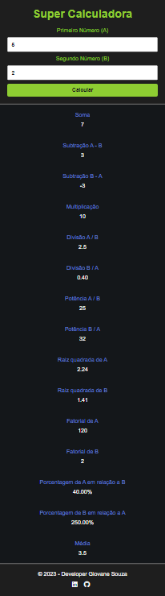

# Super calculadora

## Sobre o projeto:
Por meio desta calculadora é possível realizar todas as operações a seguir de forma simultânea:

* Soma;
* Subtração de (A - B)
* Subtração de (B - A)
* Multiplicação
* Divisão de (A / B)
* Divisão de (B / A)
* Potência (A ^ B)
* Potência (B ^ A)
* Raíz quadrada de A
* Raíz quadrada de B
* Fatorial de A
* Fatorial de B
* Porcentagem de A em relação a B
* Porcentagem de B em relação a A
* Média

## Tecnologias utilizadas:

* Html
* CSS
* JS

## Resultados obtidos:

### Layout desktop

 

### Layout Mobile (Celular)
